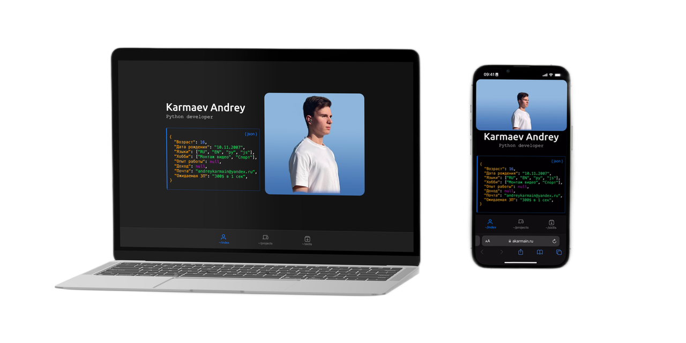

# Исходники сайта-визитки [akarmain.ru](https://akarmain.ru/home)



Этот проект представляет собой сайт-визитку, выполненный в стиле мобильного приложения, с использованием фреймворка
Ionic и Vue.js. Он содержит три основных раздела:

- Обо мне (~/index)
- Проекты (~/projects)
- Навыки (~/skills)

## Локальный запуск

### 0. Установите зависимости

- [Node.js!](https://nodejs.org/)
- [Vue CLI!](https://cli.vuejs.org/)
- [Ionic Vue!](https://ionicframework.com/docs/vue/overview)


### 1. Склонируйте репозиторий

```shell
git clone https://github.com/akarmain/site.git
cd site
```

### 2. Скачайте и установите модули и библиотеки:
```shell
npm install
```

### 3. Запустите локальный сервер
```shell
sudo npm run dev -- --host
```

---

_Спасибо, что прочитали мой код!_
